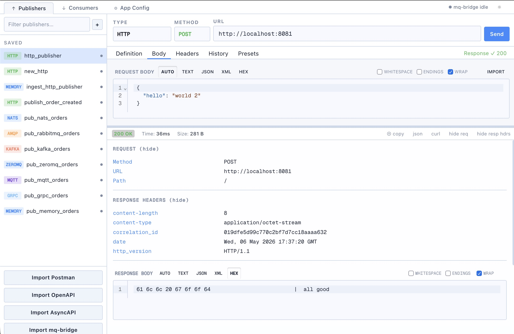

# mq-bridge-app


[](LICENSE)

```text
      ┌────── mq-bridge-app ──────┐
──────┴───────────────────────────┴──────
            crossing streams
```

`mq-bridge-app` is a **Postman-inspired** multi-protocol bridge and traffic workbench for messaging. Built with Rust and a modern Svelte UI, it allows you to connect, test, and translate between multiple messaging systems, brokers, and APIs from a single unified interface.

It provides a complete developer and operator workflow:

- manage **publishers**, **consumers**, **routes**, and app config
- run request/response traffic directly from the UI (similar to Postman for REST)
- inspect message history and response payloads
- maintain request presets and import definitions (Postman/OpenAPI/AsyncAPI/mq-bridge export)
- run as CLI/server or desktop app (Tauri)

Supported integration types include **Kafka**, **RabbitMQ (AMQP)**, **NATS**, **AWS SQS**, **MQTT**, **IBM MQ**, **HTTP**, **gRPC**, **ZeroMQ**, **MongoDB**, **sqlx(MySQL, MariaDB, PostgreSQL)**, and filesystem endpoints.

## How It Differs

`mq-bridge-app` overlaps with API clients and collections tools like Postman, Bruno, ApiArc, and similar apps, but its center of gravity is different: it is designed around message bridging, runtime operation, and long-lived route management rather than just request composition.

The table below is intentionally broad. Exact feature sets vary by product and edition, but it captures the main difference in emphasis.

| Capability | mq-bridge | Postman | Bruno | Insomnia | Hoppscotch |
| --- | --- | --- | --- | --- | --- |
| Basic HTTP/API requests | ✓ | ✓ | ✓ | ✓ | ✓ |
| Scripting | — | ✓ | ✓ | ✓ | ✓ |
| Cookie jar | Not yet | ✓ | ✓ | ✓ | ~ |
| Multipart forms | — | ✓ | ✓ | ✓ | ✓ |
| Hex-level payload debugging | ✓ | — | — | — | — |
| Broker pub/sub workflow | ✓ | MQTT | — | — | MQTT |
| Long-lived consumers/routes | ✓ | — | — | — | — |
| Bridge traffic between protocols | ✓ | — | — | — | — |
| Replay messages | ✓ |  ~ | — | — | ~ |
| Local-first workspace | ✓ | ~ | ✓ | ✓ | ~ |
| Git-friendly config | ✓ | ~ | ✓ | ✓ | ~ |
| Cloud sync by default | — | ✓ | — | Optional | Optional |
| AI / agent features | — | ✓ | — | ~ | ~ |
| Encrypted config | ✓ | ~ | ~ | ~ | ~ |


In short:

- use Postman, Bruno, or ApiArc when your main job is crafting and sharing API requests, or if you have complex authentications or request workflows;
- use `mq-bridge-app` when you need to connect systems, move messages between protocols, inspect live traffic, and manage bridge-style runtime configuration.

## Screenshot



# Status

> **Note**: This project is currently in **Active Development**.

It originally served as the primary reference implementation and testbed for the [mq-bridge](https://github.com/marcomq/mq-bridge) library. It may already work reliably for some use cases. The UI is somewhat rough and may not work in all cases. Always test thoroughly before production use.

## Features

### Connectivity
- **Multi-Protocol Support**: Bridge messages between **Kafka**, **IBM MQ**, **NATS**, **AMQP** (RabbitMQ), **MQTT**, **AWS SQS**, **gRPC**, **ZeroMQ**, **MongoDB**, **sqlx(MySQL, MariaDB, PostgreSQL)** and **HTTP**.
- **File System Integration**: Stream data from files (tail/read) or write messages to disk (append).
- **HTTP Webhooks**: Act as both an HTTP server (receiving webhooks) and client (calling external APIs), with full support for Request-Response patterns.

### Core Processing
- **Middleware Chains**: Define processing pipelines for routes, including **Dead Letter Queues (DLQ)** for robust error handling.
- **Deduplication**: Optional, persistent message deduplication to prevent processing redundant data.
- **High Performance**: Written in **Rust** using **Tokio**, ensuring low latency, high concurrency, and a small memory footprint.

### Operations & Management
- **Built-in Web UI**: Svelte-based management UI for publishers, consumers, routes, runtime status, presets, and imports.
- **Observability**: Production-ready with structured **JSON logging** and a **Prometheus** metrics endpoint.
- **Flexible Configuration**: Hierarchical configuration via files (YAML, JSON, TOML) and Environment Variables, perfect for Container/Kubernetes environments.
- **Storage Security Modes**: Supports plain storage, extracted secrets, encrypted config, and encrypted message history modes for both CLI/server and desktop workflows.

### Security & Storage
- **Config Security Modes**: Choose between plain config, extracted secrets, encrypted config, and persistent encrypted history depending on runtime target and available key storage.
- **Encrypted Message History**: Cached broker payloads and captured message history can be encrypted at rest to avoid leaving readable data behind after shutdown.
- **Local-First Operation**: Config files stay under your control instead of being tied to a mandatory cloud workspace.

## Installation

Prebuilt binaries are published on the [GitHub Releases page](https://github.com/marcomq/mq-bridge-app/releases), including the desktop Tauri bundles and CLI artifacts for supported platforms.

### MacOS Desktop App (Tauri)

Because the desktop binaries are currently not notarized, macOS may report the application as "damaged" when you first try to open it. To fix this, you need to remove the quarantine attribute.

If the app is in your `/Applications` folder, run:
```bash
sudo xattr -rd com.apple.quarantine /Applications/mq-bridge.app
```
If the app is in a user-owned directory (e.g., `~/Downloads`), `sudo` is not required:
```bash
xattr -rd com.apple.quarantine ~/Downloads/mq-bridge.app
```

### Windows

Download the Windows installer or standalone executable from the [GitHub Releases page](https://github.com/marcomq/mq-bridge-app/releases). Tauri bundle artifacts are attached there for each release.

### Linux

Use the Linux bundle from the [GitHub Releases page](https://github.com/marcomq/mq-bridge-app/releases), such as AppImage, `.deb`, `.rpm`, or the unpacked archive, depending on your distribution and preferred install flow.

## Quick Start (UI)

### Dev mode

```bash
npm install
npm run dev
```

This starts the frontend + backend dev workflow.

### Build UI bundle served by Rust backend

```bash
npm run build:ui
cargo run --release
```

### Docker CLI

The CLI version also has a docker image:

```bash
docker run --rm --name mq-bridge -p 9091:9091 ghcr.io/marcomq/mq-bridge-app:latest
```

Or if you want to already read+tail from input.log and send the content to http://localhost:3000/

```bash
touch input.log
docker run --rm --name mq-bridge -p 9091:9091 -v "$(pwd)":/app ghcr.io/marcomq/mq-bridge-app:latest --init-config=/config/file-to-http.yml
```

> [!NOTE]
> The default `latest` image is a plain multi-arch image for `amd64` and `arm64`. IBM MQ support is published separately as the `latest-ibm-mq` and `ibm-mq` tags on `amd64`, since there is no redistributable IBM MQ client library for arm64 yet. You may still start that image in emulation mode with `--platform=linux/amd64` or build `mq-bridge-app` yourself with `cargo build --release --features=ibm-mq`.

### Cargo CLI

If you have Rust installed, you can install the application directly from source. This may take some time, as it will compile all supported endpoint client libraries, except ibm-mq. For IBM MQ, you would need to install the client library first and install it with `--features=ibm-mq`.

```bash
cargo install mq-bridge-app
./mq-bridge-app
```

## Build from Source

### Prerequisites

- Rust toolchain (latest stable version recommended)
- Access to the message brokers you want to connect (e.g., Kafka, NATS, RabbitMQ)

1.  **Clone the repository:**
    ```bash
    git clone https://github.com/marcomq/mq-bridge-app
    cd mq-bridge-app
    ```

2.  **Build and run empty:**
    ```bash
    cargo run --release 
    ```
2.  **Build and run with configuration:**
    ```bash
    cargo run --release -- --config dev/config/file-to-http.yml
    ```
3.  **Configure the application:**
    Create a `config.yml` file in the project root or set environment variables. See the Configuration section for details. Or you start right away without and use the UI to define the `config.yml`
    
### Build Docker Image (doesn't require local Rust)

1.  **Prerequisites**: Docker and Docker Compose must be installed.

2.  **Start Services**:

    ```bash
    docker-compose up --build
    ```
    

    This will start the bridge cli application.

### Environment Variables

You can use environment variables directly in json/yaml / UI by using `${ENV_VARIABLE_NAME:-default_if_not_found}`.

### Using a `.env` file in cli

For local development, you can place a `.env` file in the root of the project. The application will automatically load the variables from this file.

## Architecture & Web UI

This application demonstrates a unique usage of the `mq-bridge` library itself to serve its own management UI.

### Backend: `mq-bridge` as a Web Server

Instead of using a traditional web framework like Actix or Axum directly for the management API, the application uses [mq-bridge](https://github.com/marcomq/mq-bridge/)'s internal routing mechanism:

1.  **HTTP Input**: An `http` input endpoint listens on the configured UI port. It converts incoming HTTP requests into `CanonicalMessage`s.
2.  **WebUiHandler**: A custom `Handler` processes these messages. It acts as a router, serving static files (HTML, JS) or handling API requests (e.g., `/config`, `/schema.json`).
3.  **Response Output**: The handler returns a response message, which is sent to a `response` output endpoint, completing the HTTP request-response cycle.

This approach showcases the library's ability to handle request-reply patterns and serve as a lightweight web server.

### Frontend: `vanilla-schema-forms`

The Web UI is dynamically generated from the Rust configuration structures:

1.  **Schema Generation**: The backend uses `schemars` to generate a JSON Schema for the `AppConfig` struct at runtime. This is exposed via `/schema.json`. It is also available via CLI: `mq-bridge-app --schema dev/config/schema.json`
2.  **Dynamic Form**: The frontend uses [vanilla-schema-forms](https://github.com/marcomq/vanilla-schema-forms) to render a complete configuration form based solely on this schema.
3.  **No UI Code Changes**: When new features or configuration options are added to the Rust code (e.g., a new middleware), the schema updates automatically, and the UI reflects these changes without requiring any frontend code modifications.

## Using as a Library

Beyond running as a standalone application, the core logic is available as a library crate [mq-bridge](https://github.com/marcomq/mq-bridge) to interact with various message brokers using a unified API. This is useful for building custom applications that need to produce or consume messages without being tied to a specific broker's SDK.

The core of the library are the `MessageConsumer` and `MessagePublisher` traits, found in `mq_bridge::traits`.


## License

This project is licensed under the MIT License - see the LICENSE file for details.
