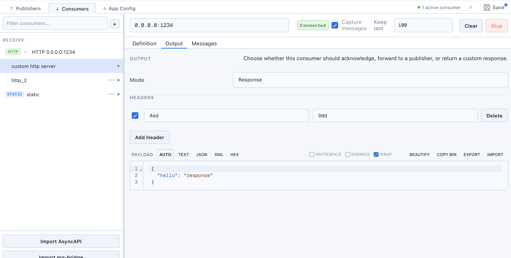
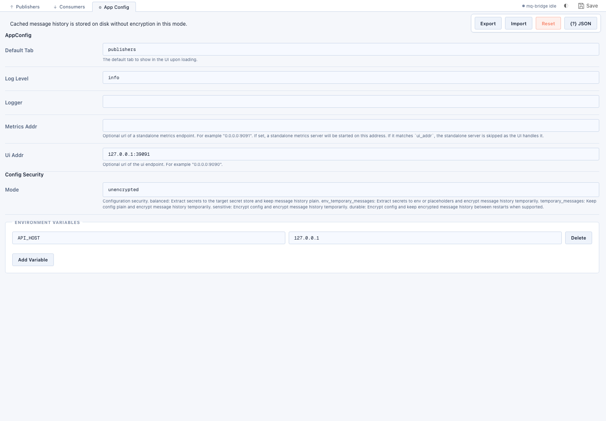

# The desktop / web UI

`mq-bridge-app` ships a visual workbench for building, testing, and running message routes.
It is the **same UI** whether you launch the [desktop app](run-forms.md#desktop-app-ui) (a Tauri
bundle) or let the [CLI serve it in a browser](run-forms.md#cli--server) — only the packaging
differs. Think of it as *Postman for message bridging*: build and test a route, export the
JSON/YAML, then run that exact config unchanged wherever you deploy.

For how the UI is built (schema-driven forms, the engine acting as its own web server), see
[How the app is built](app-architecture.md).

## Layout

The window is split into three top-level tabs, a sidebar listing your endpoints, and a top bar:

- **Publishers** (↑) — endpoints you *send to* (build/test requests, run request/response traffic).
- **Consumers** (↓) — endpoints you *receive from* (live message log, payload inspection).
- **App Config** (⚙) — application-wide settings, config security, and environment variables.

The top bar shows a **runtime status** indicator (`idle` / `active consumer(s)`), a **theme**
switcher (light / auto / dark), and **Save**. The sidebar filters endpoints and offers one-click
import from **Postman**, **OpenAPI**, **AsyncAPI**, and existing **mq-bridge** configs.

## Publishers

Select or add a publisher on the left, then edit it on the right. The header row holds the
endpoint **type** (HTTP, Kafka, NATS, …), method, and URL, with a **Send** button to fire a
request. Below it are per-endpoint tabs:

- **Definition** — name, endpoint type and connection settings (with *Show advanced options*),
  and a **Middlewares** list you can add to / remove from (metrics, retries, transforms, …).
- **Body** / **Headers** — the outgoing payload (with `AUTO` / `TEXT` / `JSON` / `XML` / `HEX`
  views) and header rows.
- **History** / **Presets** — previous sends and saved request presets.

After a **Send**, the response panel shows status, timing, request/response headers, and the
response body (including a **HEX** view), with `copy` / `json` / `curl` shortcuts.
`Copy to Consumer`, `Clone`, `{}` (view raw JSON), and `Delete` act on the selected endpoint.

## Consumers

Consumers receive messages live. The header shows the connection state (`Connected`), a
**Capture messages** toggle, a **Keep last N** limit, and **Clear** / **Stop** controls. Tabs:

- **Definition** — connection settings, same shape as a publisher.
- **Output** — the consumer's response/output configuration.
- **Messages** — a live log (time + payload preview). Click a row to inspect it below:
  **Message Headers**, **Message Body**, and any **Response Headers / Body**, each with
  `AUTO` / `TEXT` / `JSON` / `XML` / `HEX` views plus copy/export.

## App Config

Application-wide settings rendered directly from the `AppConfig` schema:

- **AppConfig** — default tab, log level, logger, metrics address, and UI address.
- **Config Security** — the storage **mode** (`unencrypted`, `balanced`, `sensitive`,
  `durable`, …) controlling how secrets and cached message history are stored. See
  [Encryption at rest](../cookbook/encryption.md) and [Secrets](../cookbook/secrets.md).
- **Environment Variables** — key/value pairs available for
  [interpolation](../cookbook/secrets.md) in endpoint URLs and settings.

`Export`, `Import`, `Reset`, and `{?} JSON` operate on the whole configuration.

## The configuration-first workflow

The point of one shared config format is that you **test connections and dial in a route in the
UI, export the JSON/YAML, then run that exact config unchanged** — as a
[`copy` command](../reference/cli.md), a config-mode service, or loaded from
[library code](../tutorials/embedding.md). A known-good route shape from the UI drops straight
into production.

## How the UI differs from API clients

The UI overlaps with API clients like Postman, Bruno, and Insomnia, but its centre of gravity is
different: it is built around **message bridging, runtime operation, and long-lived route
management** rather than one-off request composition. It adds broker pub/sub workflows,
long-lived consumers/routes, protocol-to-protocol bridging, hex-level payload debugging, replay,
local-first git-friendly config, and encrypted config — while leaving scripting and complex
request chaining to the dedicated API clients.

> **Status.** The UI/Tauri layer was prototyped quickly and does not mirror the
> `mq-bridge` / core/CLI standards — treat it as a working demo, not a reference implementation,
> and test before relying on it in production.
